## 📄 Project Summary – Hopbridge Outreach (Salesforce NPSP)

**Hopbridge Outreach** is a fictional nonprofit organization supporting underserved communities through wellness programs and food assistance.

This project demonstrates how a Salesforce Admin can implement a simple yet powerful CRM system for a small nonprofit using the **Nonprofit Success Pack (NPSP)**. The solution focuses on tracking relationships, managing service types, and automating follow-ups to ensure no one falls through the cracks.

### 🎯 Problem We’re Solving

Small nonprofits often lack the time, skills, or budget to set up CRMs that match their workflows. Staff rely on spreadsheets or email to track donor or client interactions — leading to:
- Missed follow-ups
- Poor reporting
- Limited visibility into outreach efforts

### ✅ Our Goal

Build a lean, functional Salesforce CRM with:
- Clean data model tailored to nonprofit needs
- Custom fields for key information (e.g., service type, constituent role)
- Automations to trigger follow-up tasks
- Simple dashboards to track outreach and services

### 🛠️ Tools & Features Used

- **Salesforce Nonprofit Success Pack (NPSP)** – preconfigured CRM for nonprofits
- **Custom Fields & Layouts** – to capture what matters most
- **Salesforce Flows** – to automate follow-up reminders
- **Reports & Dashboards** – for clear visibility into outreach
- **Campaigns and Event Tracking** -  Tracks participation, donations, and outcomes for marketing campaigns and events.
- **Einstein 1 Agent Assistant** - Uses AI to quickly find information, answer questions, and complete tasks.
- **GitHub** & **Google docs** – for project documentation
- **Loom & Screenshots** – for visual walkthroughs

### 🎉 What We’ll Deliver

By the end of this project, we will have:
- A working Salesforce nonprofit org with customizations
- Automated follow-up Flow for better engagement
- A portfolio-ready GitHub repo with clear documentation
- Reusable structure for similar nonprofit client projects

# Project Build Log – HopeBridge CRM (Salesforce)

This document tracks each major implementation step in the HopeBridge nonprofit CRM project. It follows the configuration of Salesforce Nonprofit Success Pack (NPSP), automation using Flows, reporting, and AI enhancements.

---

## Step 1 – Developer Org Setup

- Signed up for a Salesforce Developer Org at developer.salesforce.com
- Created username and logged into the Lightning Experience successfully
- Verified access to standard objects: Leads, Contacts, Opportunities

---

## Step 2 – Install Nonprofit Success Pack (NPSP)

- Installed NPSP via official Salesforce.org link
- Selected “Install for All Users” and approved third-party access
- Confirmed installation complete
- Verified NPSP-specific tabs: Donations, Households, Affiliations, etc.

## Confirm NPSP Installation

After installing the Nonprofit Success Pack, verify that it appears in the App Launcher with the correct tabs.
## Step 2 – Confirm NPSP Installation

After installing the Nonprofit Success Pack, verify that it appears in the App Launcher with the correct tabs.

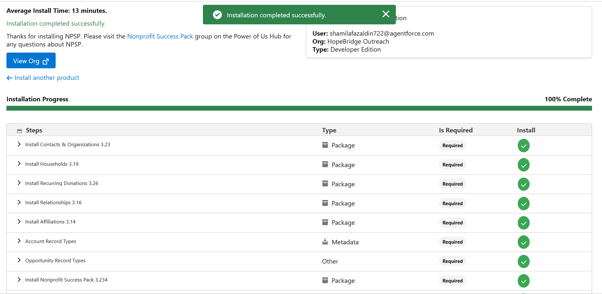

---

## Step 3 – Customize Contact Object

- Added custom fields:
  - Constituent Role (Donor, Volunteer, Client, Staff)
  - Service Type (Food, Wellness, Both)
  - Follow-Up Date (Date field)
- Updated Contact Page Layout to display new fields

## Added Custom Fields to Contact

We customized the Contact object to include fields that reflect our nonprofit’s needs.

- **Constituent Role (Picklist):** Donor, Volunteer, Recipient, etc.
- **Service Type (Picklist):** Food Support, Wellness Coaching, etc.
- **Follow-Up Date (Date):** Next check-in date for each contact

These fields help categorize and schedule outreach with individuals served.

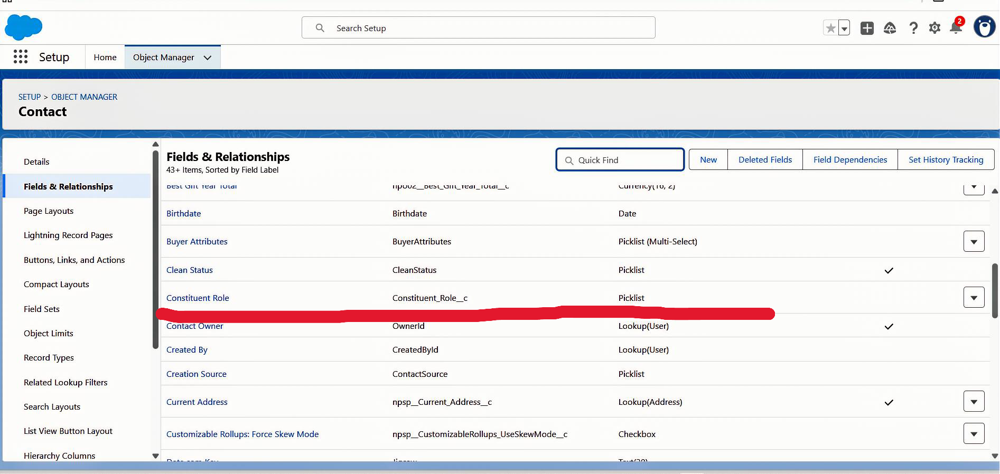

## Add Custom Fields to Page Layout

We added our three custom fields to the standard Contact Layout so users can easily view and update important data:

- **Constituent Role** – The individual’s role in the nonprofit (e.g., Donor, Volunteer)
- **Service Type** – The type of service they’re receiving (e.g., Food Support, Wellness Coaching)
- **Follow-Up Date** – The next scheduled contact or outreach date

All fields were added under the main Contact Information section.

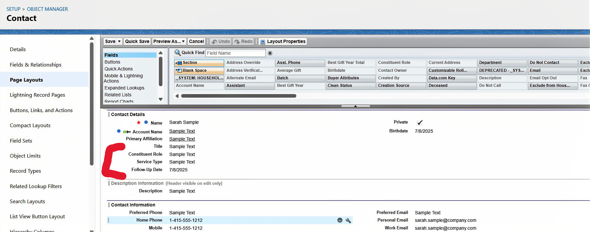

🎥 Loom Walkthrough – Field Placement & Layout Setup:  
[Watch on Loom](https://www.loom.com/share/5cf029c1749e46fcb8f2fa9ff82e71f8?sid=136d6c89-93d4-4927-a61e-4837cb893130)

---

## Step 4 – Record-Triggered Flow: Auto-Follow-Up Task (Contact)

This Flow ensures that important follow-up actions are not missed during community outreach.

It watches for **new Contact records** where a **Follow-Up Date** is provided, and automatically creates a **Task** for the team to follow up with that contact on the specified date.

### Flow Trigger Settings:
- Object: Contact
- Trigger: Record is Created
- Condition: Follow_Up_Date__c Is Null = False
- Optimization: Actions and Related Records

This supports better engagement and continuity for both food and wellness program participants.

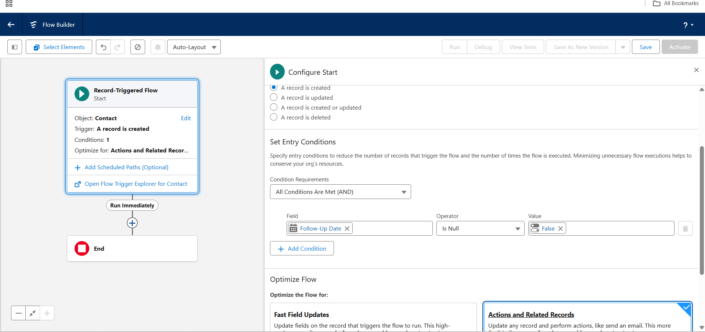

### Step 4.2 – Configure "Create Follow-Up Task" Element

We configured the **Create Records** element to generate a Task assigned to the current user, reminding them to follow up with the new contact.
**Field Mappings:**

- **Subject**: `Follow up with {!$Record.FirstName}` *(Formula resource: `FollowUpTaskSubject`)*
- **Due Date Only**: `Triggering Contact → Follow_Up_Date__c`
- **Assigned To ID**: `Triggering Contact → OwnerId → UserId`
- **Name ID**: `Triggering Contact → Contact ID`
- **Status**: `Not Started`
- **Priority**: `Normal`
- **Description**: `Follow-up scheduled during intake.`

This improves internal task management and ensures timely follow-ups with newly added contacts.

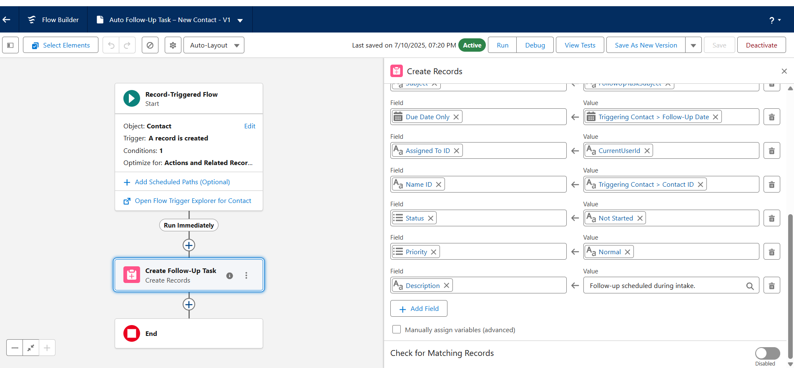

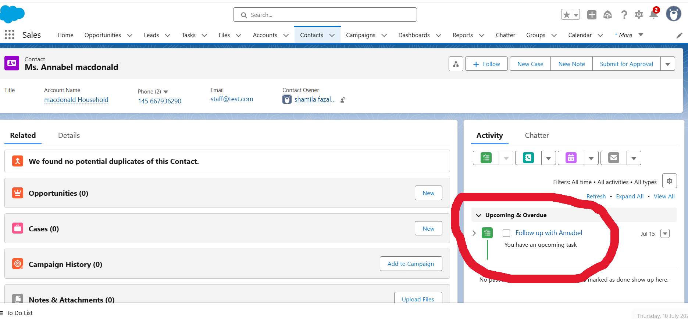

[Watch on Loom](https://www.loom.com/share/6f9e4160e4d74499afd8f593cd128584?sid=aec4fb5c-1380-42b8-9591-bec2e4ec01fc)

## Step 5 – Create Record-Triggered Flow: Auto Follow-Up Task for New Donation

- Triggered on new Opportunity record where Type = Donation
- Automatically creates Task for assigned user to follow up
- Flow tested and verified using a sample donation

This Flow creates a follow-up Task whenever a new Donation (Opportunity) is logged in the system. It helps ensure that all donors are thanked or contacted promptly by the team.

### Flow Trigger Settings:
- Object: Opportunity
- Trigger: Record is Created
- Entry Condition: `Opportunity.Type` Equals `New Customer`
- Optimization: Actions and Related Records

The Flow assigns a Task to the record owner for immediate donor engagement.

### Create Records elements:

**Field Mappings:**

- **Subject**: `Follow up on new donation`
- **Due Date Only**: `Triggering Opportunity → CloseDate`
- **Assigned To ID**: `Triggering Opportunity → OwnerId`
- **Related To ID**: `Triggering Opportunity → Id`
- **Status**: `Not Started`
- **Priority**: `Normal`
- **Description**: `Please contact the donor to thank them for their recent contribution.`

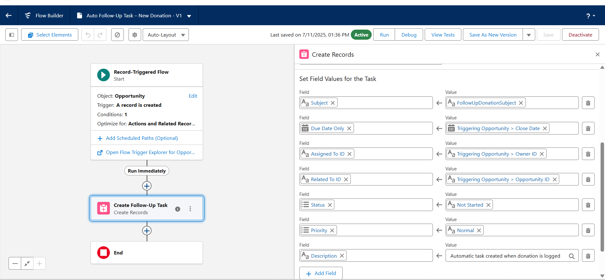

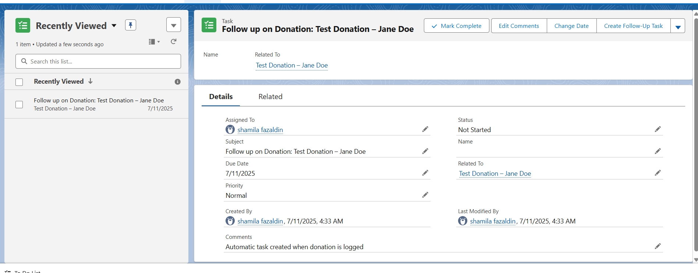

🎥 Loom Walkthrough – Donation Task Automation:  
[Watch on Loom](https://www.loom.com/share/38faeeb60de9460a9b469fab2c6dbfea?sid=2e077f1d-08a1-47d4-8d77-b9fe2cc22cd1)

---

## Step 6 – Create Scheduled Flow: Re-Engagement for Inactive Donors

- In a real-world org, this would be set to run weekly/monthly, with deduplication logic to avoid creating repeated tasks for the same donor.
- Scheduled run once 
- Finds Contacts with no donation in the past 6 months
- Creates Task for admin to re-engage with donor
- It searches for **Contacts who have not made a donation in the past 6 months** and assigns a follow-up Task to the admin or designated user. This supports long-term donor retention and proactive outreach
- 
### Flow Trigger Settings:
- **Flow Type**: Scheduled-Triggered Flow
- **Frequency**: once
- **Start Date/Time**: [Tomorrow at 12:00 AM or your preferred start time]
- **Object**: Contact
- **Entry Conditions**: None (all Contacts are evaluated in the next step)
- **Optimization**: Actions and Related Records

This lays the foundation for identifying inactive donors and automating timely follow-ups.

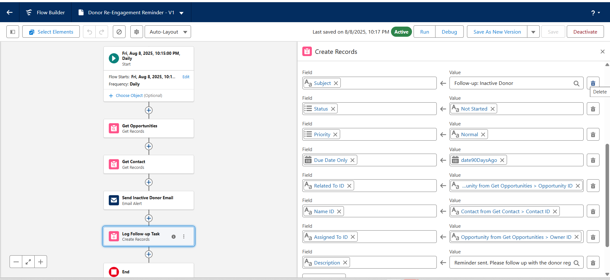

🎥 Loom Walkthrough – Scheduled Flow Setup  
[Watch on Loom](https://www.loom.com/share/YOUR-LOOM-ID-HERE)

---

## Step 7 – Reports & Dashboards

### Overview
Built a comprehensive reporting solution for HopeBridge Outreach to track donor engagement, volunteer participation, and program impact through a single executive dashboard.

### Business Requirements
- Executive team requires a unified view of organizational performance  
- Key Metrics: Donation trends, volunteer hours, client services, program ROI  
- User Personas: Executive Director, Development Manager, Program Coordinators  

### Implementation Summary
- Created a unified report showing donor and program metrics using **Accounts with Opportunities** report type  
- Built an executive dashboard with key charts for donations, donor rankings, program split, and performance metrics  

### Technical Skills Demonstrated
- Complex report filters, groupings, and calculated summaries  
- Dashboard design with multiple chart types and responsive layout  
- Cross-object data analysis and executive-focused UX  

### Business Impact
- Reduced manual reporting time significantly  
- Enhanced real-time decision-making with visual insights  
- Improved donor stewardship and resource allocation visibility  

### Screenshots & Demo

#### Combined Report & Dashboard View  
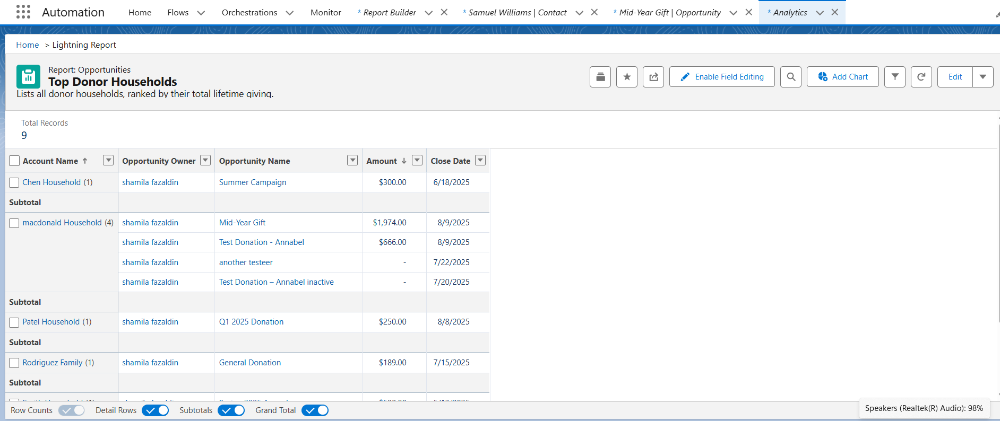  

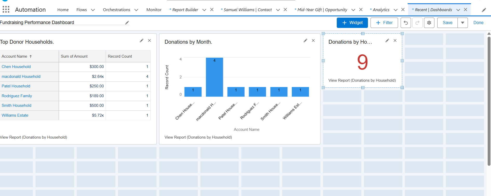 

🎥 Walkthrough HopeBridge Dashboard Overview  (https://drive.google.com/file/d/1BPHuejb23NBvzGsKTSpjQfPK_0isSNYL/view?usp=sharing)

---

## Step 8 – Campaigns and Event Tracking

- Created sample Campaigns for:
- Food Drive – August
- Wellness Workshop – September
- Added sample Contacts to Campaigns
- Verified Campaign Member statuses (Planned, Responded, Attended)

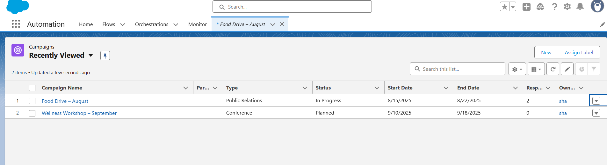 

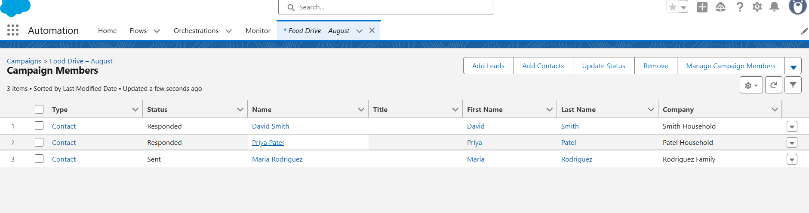 

🎥 Walkthrough HopeBridge campaigns names & contacts (https://drive.google.com/file/d/1mdFJJ-aUXmp9--fOn5Sy7mco98AE3jft/view?usp=sharing)

---

## Step 9 – AI Assistant (Einstein Bot)

Configured a conversational AI assistant using **Einstein Bots** to help staff quickly access key donor, volunteer, and campaign information.

### Bot Dialogs Created
- **Get Donor Information** – Asks how many top donors to display and retrieves them dynamically.  
- **Check on Volunteers** – Requests a campaign name and reports how many volunteers attended.  
- **Review Campaign Performance** – Guides the user on where to find campaign metrics and reports.

### Core Components Built
- **Einstein Bot**: Created the **Outreach Assistant** bot with a Welcome message and Main Menu leading to three conversational paths.  

#### Flow – Bot – Get Top Donors
- **Inputs**: `numberOfDonors_Input` (number).  
- **Logic**:  
  - Query **Opportunity** for "Closed Won" donations where **Primary Contact** is not null.  
  - Sort by **Amount (DESC)**.  
  - Loop through records, limit by requested number.  
  - Perform **Get Records** on **Contact** to retrieve donor **Full Name**.  
  - Use **Text Template + Assignment** to format donor name and donation amount.  
- **Output**: `topDonorsOutput` string passed back to the bot.

 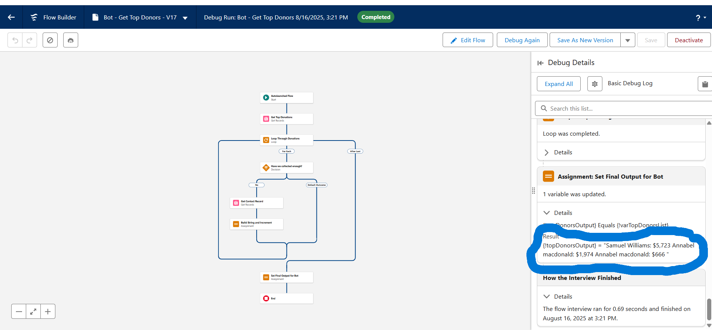 
 
🎥 Walkthrough HopeBridge Get Top Donor Bot Testing (https://drive.google.com/file/d/1ocspLciOXiaYTnP8mlHxC4sXcLcg9C3t/view?usp=sharing)

#### Flow – Bot – Get Volunteer Count
- **Inputs**: `campaignName_Input` (text).  
- **Logic**:  
  - Query **Campaign** by exact name.  
  - Query **Campaign Member** with `Status = Attended`.  
  - Use **Equals Count** to total number of volunteers.  
- **Output**: `volunteerCount_Output` integer passed back to the bot.  

### Key Challenge & Solution – Permissions
- **Problem**: Bot failed with "system error" when calling Flows (but worked in Debugger).  
- **Cause**: Default **Basic Bot User** lacked object/flow permissions.  
- **Solution**:  
  1. Created a new Profile (**Bot Profile**) with **View All Data** + **Run Flows**.  
  2. Created a dedicated User (**Assistant User**) with this Profile.  
  3. In Bot Settings → switched Bot User from *Basic* to this **Custom User**.  
  4. Bot now successfully accesses Opportunities, Contacts, and Campaign Members.  

 
  
 
🎥 Walkthrough HopeBridge Get Volunteer Count (https://drive.google.com/file/d/1gbCDvcR4X1B4b9mEC4_Qs62TXVc6VQqD/view?usp=sharing)

---
✅ **Result:** A working conversational bot that reduces manual lookup tasks by surfacing donor, volunteer, and campaign insights in real time.

---

## Step 11 – Final Testing and Demo Preparation

- Created 2 test Contacts, 2 sample Donations, and 1 Campaign
- Ran all Flows and verified outcomes
- Final screenshots and Loom walkthroughs created for portfolio
