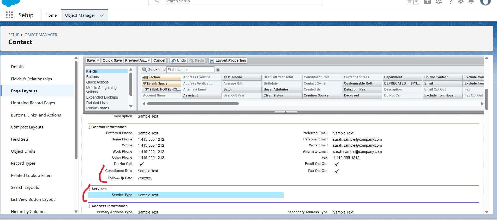

## 📄 Project Summary – Hopbridge Outreach (Salesforce NPSP)

**Hopbridge Outreach** is a fictional nonprofit organization supporting underserved communities through wellness programs and food assistance.

This project demonstrates how a Salesforce Admin can implement a simple yet powerful CRM system for a small nonprofit using the **Nonprofit Success Pack (NPSP)**. The solution focuses on tracking relationships, managing service types, and automating follow-ups to ensure no one falls through the cracks.

### 🎯 Problem We’re Solving

Small nonprofits often lack the time, skills, or budget to set up CRMs that match their workflows. Staff rely on spreadsheets or email to track donor or client interactions — leading to:
- Missed follow-ups
- Poor reporting
- Limited visibility into outreach efforts

### ✅ Our Goal

Build a lean, functional Salesforce CRM with:
- Clean data model tailored to nonprofit needs
- Custom fields for key information (e.g., service type, constituent role)
- Automations to trigger follow-up tasks
- Simple dashboards to track outreach and services

### 🛠️ Tools & Features Used

- **Salesforce Nonprofit Success Pack (NPSP)** – preconfigured CRM for nonprofits
- **Salesforce Flows** – to automate follow-up reminders
- **Custom Fields & Layouts** – to capture what matters most
- **Reports & Dashboards** – for clear visibility into outreach
- **GitHub** – for project documentation
- **Loom & Screenshots** – for visual walkthroughs

### 🎉 What We’ll Deliver

By the end of this project, we will have:
- A working Salesforce nonprofit org with customizations
- Automated follow-up Flow for better engagement
- A portfolio-ready GitHub repo with clear documentation
- Reusable structure for similar nonprofit client projects

# Project Build Log – HopeBridge CRM (Salesforce)

This document tracks each major implementation step in the HopeBridge nonprofit CRM project. It follows the configuration of Salesforce Nonprofit Success Pack (NPSP), automation using Flows, reporting, and AI enhancements.

---

## Step 1 – Developer Org Setup

- Signed up for a Salesforce Developer Org at developer.salesforce.com
- Created username and logged into the Lightning Experience successfully
- Verified access to standard objects: Leads, Contacts, Opportunities

---

## Step 2 – Install Nonprofit Success Pack (NPSP)

- Installed NPSP via official Salesforce.org link
- Selected “Install for All Users” and approved third-party access
- Confirmed installation complete
- Verified NPSP-specific tabs: Donations, Households, Affiliations, etc.

## Confirm NPSP Installation

After installing the Nonprofit Success Pack, verify that it appears in the App Launcher with the correct tabs.
## Step 2 – Confirm NPSP Installation

After installing the Nonprofit Success Pack, verify that it appears in the App Launcher with the correct tabs.

---

## Step 3 – Customize Contact Object

- Added custom fields:
  - Constituent Role (Donor, Volunteer, Client, Staff)
  - Service Type (Food, Wellness, Both)
  - Follow-Up Date (Date field)
- Updated Contact Page Layout to display new fields

## Added Custom Fields to Contact

We customized the Contact object to include fields that reflect our nonprofit’s needs.

- **Constituent Role (Picklist):** Donor, Volunteer, Recipient, etc.
- **Service Type (Picklist):** Food Support, Wellness Coaching, etc.
- **Follow-Up Date (Date):** Next check-in date for each contact

These fields help categorize and schedule outreach with individuals served.

## Add Custom Fields to Page Layout

We added our three custom fields to the standard Contact Layout so users can easily view and update important data:

- **Constituent Role** – The individual’s role in the nonprofit (e.g., Donor, Volunteer)
- **Service Type** – The type of service they’re receiving (e.g., Food Support, Wellness Coaching)
- **Follow-Up Date** – The next scheduled contact or outreach date

All fields were added under the main Contact Information section.

🎥 Loom Walkthrough – Field Placement & Layout Setup:  
[Watch on Loom](https://www.loom.com/share/5cf029c1749e46fcb8f2fa9ff82e71f8?sid=136d6c89-93d4-4927-a61e-4837cb893130)

---

## Step 4 – Record-Triggered Flow: Auto-Follow-Up Task (Contact)

This Flow ensures that important follow-up actions are not missed during community outreach.

It watches for **new Contact records** where a **Follow-Up Date** is provided, and automatically creates a **Task** for the team to follow up with that contact on the specified date.

### Flow Trigger Settings:
- Object: Contact
- Trigger: Record is Created
- Condition: Follow_Up_Date__c Is Null = False
- Optimization: Actions and Related Records

This supports better engagement and continuity for both food and wellness program participants.

### Step 4B – Configure "Create Follow-Up Task" Element

We configured the **Create Records** element to generate a Task assigned to the current user, reminding them to follow up with the new contact.
**Field Mappings:**

- **Subject**: `Follow up with {!$Record.FirstName}` *(Formula resource: `FollowUpTaskSubject`)*
- **Due Date Only**: `Triggering Contact → Follow_Up_Date__c`
- **Assigned To ID**: `$User → Id` *(or use a variable if $User.Id is not selectable)*
- **Name ID**: `Triggering Contact → Contact ID`
- **Status**: `Not Started`
- **Priority**: `Normal`
- **Description**: `Follow-up scheduled during intake.`

This improves internal task management and ensures timely follow-ups with newly added contacts.

## Step ? – Create Record-Triggered Flow: Follow-Up Task for New Donation

- Triggered on new Opportunity record where Type = Donation
- Automatically creates Task for assigned user to follow up
- Flow tested and verified using a sample donation

---

## Step 5 – Create Scheduled Flow: Re-Engagement for Inactive Donors

- Scheduled monthly run
- Finds Contacts with no donation in the past 6 months
- Creates Task for admin to re-engage with donor

---

## Step 6 – Campaigns and Event Tracking

- Created sample Campaigns for:
  - Food Drive – August
  - Wellness Workshop – September
- Added sample Contacts to Campaigns
- Verified Campaign Member statuses (Planned, Responded, Attended)

---

## Step 7 – Record-Triggered Flow: Reminder Email for Upcoming Events

- Flow triggered when Follow-Up Date = Today
- Sends email reminder to assigned Contact using Email Alert
- Custom Email Template created for reminder message

---

## Step 8 – Reports and Dashboards

- Created report types:
  - Donations by Campaign
  - Volunteer Participation
  - Overdue Tasks by Assigned User
- Built a dashboard with 4 components using the above reports

---

## Step 9 – Optional Add-On: Einstein 1 Agent Assistant

- Enabled and added Einstein 1 Agent to App
- Configured 3 sample prompts:
  - "Show top donors this month"
  - "List all upcoming events"
  - "Create follow-up task for new contact"
- Verified responses via Einstein UI

---

## Step 10 – Final Testing and Demo Preparation

- Created 2 test Contacts, 2 sample Donations, and 1 Campaign
- Ran all Flows and verified outcomes
- Final screenshots and Loom walkthroughs created for portfolio
